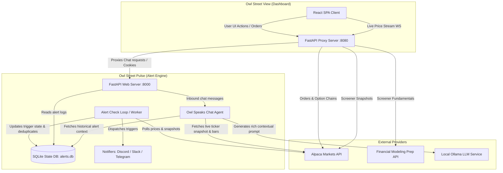

# Owl Street Trading & Alerting Ecosystem 🦉📈

Welcome to the **Owl Street** monorepo—a production-grade, self-hosted suite of tools for real-time asset market monitoring, algorithmic alerting, technical indicators calculation, options analysis, and order management.

The ecosystem is split into two primary backend-backed services and a modular React frontend dashboard:

1. **[owl-street-pulse](./owl-street-pulse)** 🚨: An asset checking and real-time alert engine (FastAPI + SQLite + background worker) that dispatches notifications to Discord, Slack, Telegram, and System Console. It also hosts the central **Owl Speaks** Ollama-based chat agent.
2. **[owl-street-view](./owl-street-view)** 💻: A high-fidelity trading dashboard consisting of a FastAPI proxy/API backend and a React single-page application.
3. **Screener Component** 🔍: A premium stock screener integrated directly into the `owl-street-view` frontend and backend, merging Alpaca real-time market snapshots with fundamental ratios from Financial Modeling Prep (FMP).

---

## 🏗️ System Architecture

The following diagram illustrates how the applications interoperate, ingest market data, manage state, and handle user interaction.



---

## 📂 Monorepo Structure

```
owls-street/
├── owl-street-pulse/          # Asset Alerting System & Owl Speaks Chat Backend
│   ├── src/                   # Python core (main.py, engine.py, chat.py, web.py)
│   ├── config/                # Polling and technical rule monitors
│   └── tests/                 # Unit test suite for alerts & chat integration
│
├── owl-street-view/           # Trading Dashboard & Option Matrix
│   ├── src/                   # FastAPI backend (main.py, web.py, alpaca_service.py)
│   ├── frontend/              # React SPA frontend (Vite/ESBuild)
│   │   ├── src/components/    # UI Views (Chart, OptionChainMatrix, Screener, OwlSpeaksChat)
│   │   └── src/theme.css      # Shared glassmorphic CSS theme tokens
│   └── SCREENER.md            # Detailed documentation for the Stock Screener
│
└── README.md                  # This file
```

---

## ⚡ Getting Started

Both applications use standalone helper scripts named `run.sh` to initialize their respective environments, copy configuration templates, install dependencies, and launch servers.

### Prerequisites

- **Python 3.9+** and `pip`
- **Node.js 16+** and `npm` (for building the frontend assets)
- **Alpaca API Keys** (Free Paper or Live Account)
- **Financial Modeling Prep (FMP) API Key** (optional, required for the fundamental scanning features of the Screener)
- **Ollama** (optional, running locally for the Owl Speaks Chat Agent feature)

### Step 1: Run the Alerting Engine (Pulse)

Navigate to the [owl-street-pulse](./owl-street-pulse) directory:
```bash
cd owl-street-pulse
./run.sh
```
This script will copy `.env.example` -> `.env`, build a virtual environment, run indicator tests, and start the daemon at **[http://localhost:8000](http://localhost:8000)**. 
Open `.env` to customize your Alpaca credentials, Ollama configurations, and webhook destinations.

### Step 2: Run the Trading Dashboard & Screener (View)

In a separate terminal tab, navigate to the [owl-street-view](./owl-street-view) directory:
```bash
cd owl-street-view
./run.sh
```
This script copies configurations, installs dependencies, compiles React production bundle assets, and launches the dashboard at **[http://localhost:8080](http://localhost:8080)**.
Configure your `.env` in `owl-street-view` to specify target port and API configurations.

> [!NOTE]
> During active UI/React development, you can boot the backend server via `./run.sh`, then navigate to `owl-street-view/frontend` and run `npm start` or `npm run dev` to launch the frontend with hot-module replacement (configured to proxy requests automatically to port `8080`).

---

## 📖 Component Documentation

For details on configuration and running specific systems, please refer to their respective READMEs:
- **Alert System Guide**: Refer to [owl-street-pulse/README.md](./owl-street-pulse/README.md)
- **Dashboard Interface Guide**: Refer to [owl-street-view/README.md](./owl-street-view/README.md)
- **Stock Screener Deep-Dive**: Refer to [owl-street-view/SCREENER.md](./owl-street-view/SCREENER.md)
