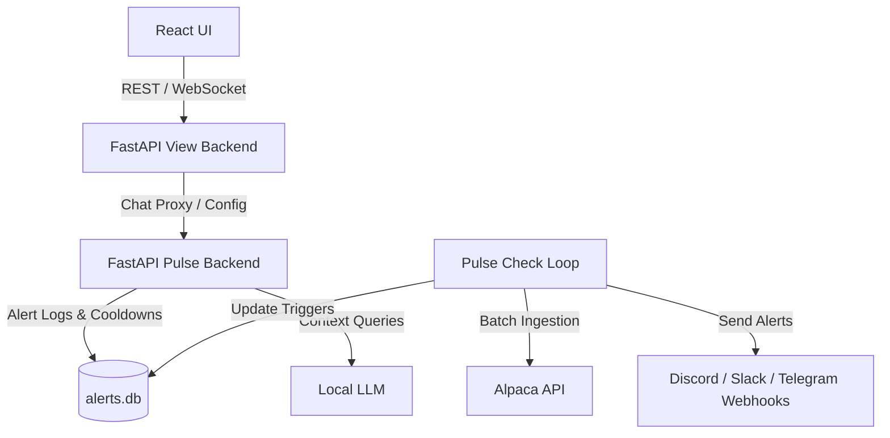

# System Architecture & Overview Spec

## Ecosystem Goals

The Owl Street monorepo houses a complete, high-fidelity asset alert and trading ecosystem built to run self-hosted. It consists of:
1. **Real-time Alerting Backend (`owl-street-pulse`)**: An active monitoring and technical calculation engine.
2. **Dashboard UI Proxy (`owl-street-view`)**: A glassmorphic web dashboard providing visual analysis and active trading capabilities.

## Technology Stack & Architecture

### Backend Services
* **Framework**: FastAPI (Python 3.9+) provides the REST endpoints and WebSocket servers.
* **Server**: Uvicorn.
* **Database**: SQLite manages stateful candle tracking, historical alert deduplication, and cooldown tracking.
* **AI Engine**: Local Ollama instance executes natural language queries on local alert database history and live market pricing data.

### Frontend Application
* **Framework**: React SPA built on Vite.
* **Styling**: Glassmorphism CSS system using CSS variables, custom styles, and responsive CSS containers.
* **Charts**: TradingView `lightweight-charts` for candle plotting, crossovers, indicators, and drawings.

### Core External Integrations
* **Alpaca API**: Ingestion of real-time quotes, historical candles, order book details, and option chains.
* **Financial Modeling Prep (FMP)**: Fetching corporate fundamentals (market cap, revenue growth, metrics) for stock scanning.

